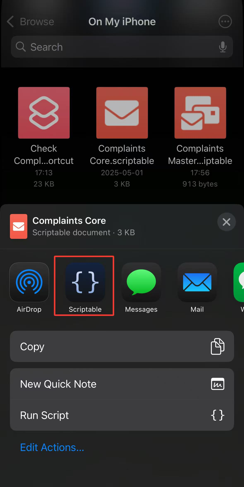
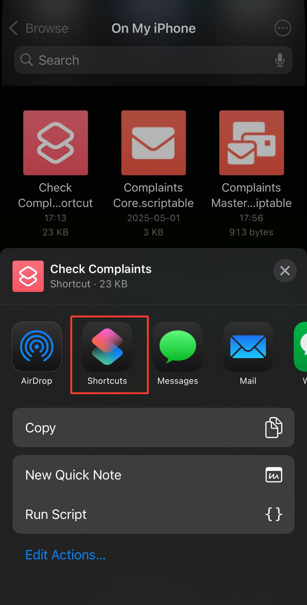
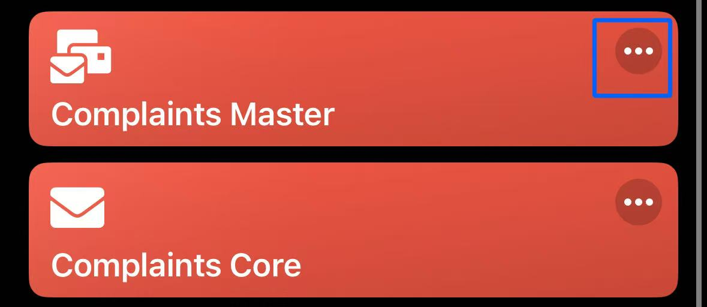
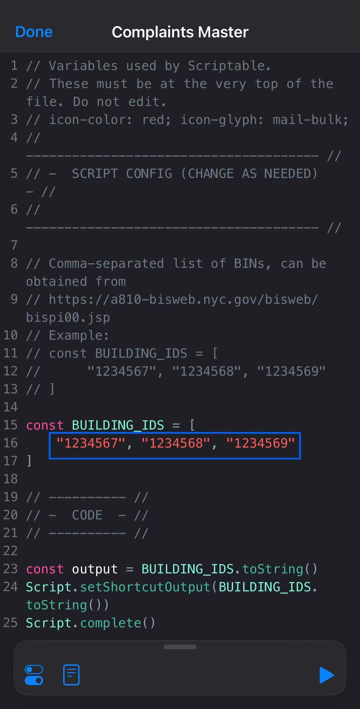
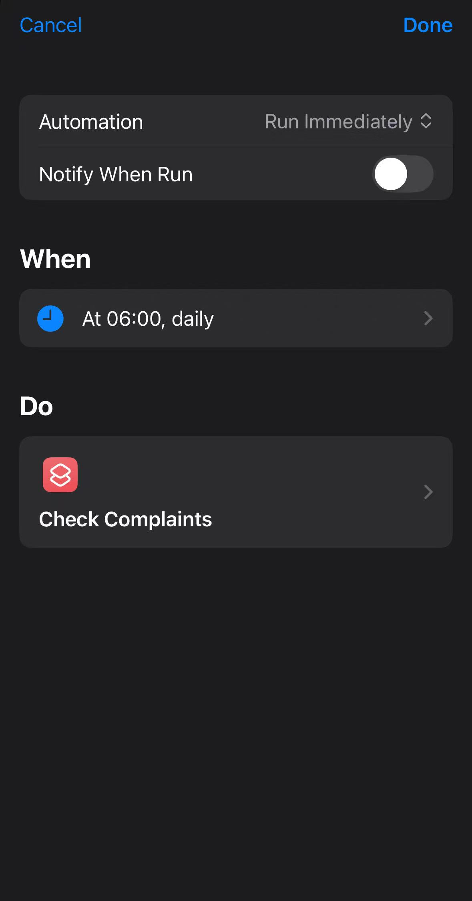

# Scriptable-NYC-Building-Complaint-Notifications-for-iOS-Users
Scriptable-based js script that pulls details of all DOB building complaints from [NYC Open Data](https://data.cityofnewyork.us/Housing-Development/DOB-Complaints-Received/eabe-havv/about_data) and sends a push notification when a new complaint has been opened or an old complaint has been updated since the last check. Can be used with automations within the Shortcut app to periodically check for updates.

I wrote this for a friend, I thought I might share it in case someone else might have the same needs.

# Dependencies
### [Scriptable](https://scriptable.app/)

### [Shortcuts](https://apps.apple.com/us/app/shortcuts/id1462947752)

# Install and use
1. Download all files from the [latest release](https://github.com/AmberMLiu/Scriptable-NYC-Building-Complaint-Notifications-for-iOS-Users/releases).
2. Import `Complaints Master.scriptable` and `Complaints Core.scriptable` into Scriptable, by selecting "share options -> Scriptable". 
3. Import `Check Complaints.shortcut` into Shortcuts, by selecting "share options -> Shortcuts". 
4. Open `Complaints Master` in the Scriptable app by tapping the three dots in the top right. Populate `BUILDING_IDs` with BINs of desired buildings. BINs can be obtained from [BIS Web](https://a810-bisweb.nyc.gov/bisweb/bispi00.jsp). 
5. (optional) Set up a Personal Automation within the Shortcuts app to run `Check Complaints` automatically at the desired frequency (e.g. daily). Make sure to select "Run Immediately" and turn off "Nofity When Run" to ensure the script runs silently. 
# Other Notes
Complaints which were already reported are cached in `iCloud Drive/Scriptable/complaints`. Expect many notifications the first time the routine is run.